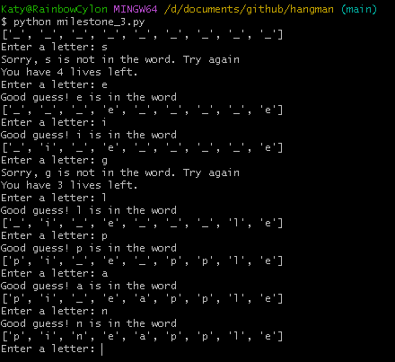
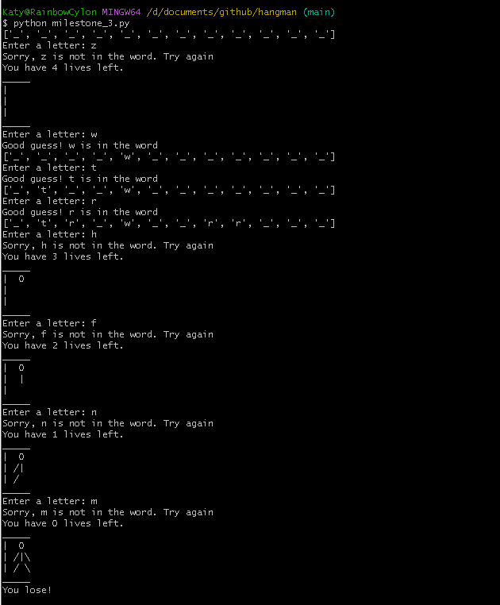

# Hangman

In this project I have created the game Hangman using python. Once started, the game will choose a fruit from a list of items and replace the number of letters with blanks to fill in. It will ask you to enter a letter, if the letter is contained in the secret word, it will imput the letter into the correct position. If not, it will remove a life from your stash and begin building the hangman. The game ends either when you guess the word correctly, or you lose 5 lives. 
This project allowed me to develop my coding skills in python and consolidate some of the principles that I have previously learnt such as if and while loops. I have also begun learning, understanding and applying basic principles of OOP (Classes).

## Getting Started

* Install Python (3.11.0)
* In the command line, from the project directory **hangman**, execute
```
python milestone_3.py
```


## Milestone 2

I have built a word_list and a simple guess variable which takes in the user input. Based on the user input, a "Good guess!" or a "Oops! That is not a valid guess." will be displayed. 

```python
import random

word_list = ['pineapple', 'strawberries', 'raspberries', 'peach', 'apple']

print(word_list)

word = (random.choice(word_list))

print(word)

guess = input('Enter a letter')

if len(guess) == 1:
    print('Good guess!')
else:
    print('Oops! That is not a valid input.')
    
```


## Milestone 3

I have used the word_list and random word generator from milestone_1. I imported the file into milestone_2, making the word chooser a function. 


```python
from milestone_1 import word, word_list

guess = ''

def ask_for_imput(guess):
    guess = input('Enter a letter: ')

    while len(guess) != 1 or guess.isalpha() == False:
        print("Invalid letter. Please enter a single alphabetical character.")
        guess = input('Enter a letter: ')

secret_word = (word(word_list))

def check_guess(guess): 
    guess.lower()
    if guess in secret_word:
        print(f'Good guess! {guess} is in the word')
    else:
        print(f'Sorry, {guess} is not in the word. Try again')

ask_for_imput(guess)
```


## Milestone 4

I have used the variables/functions created in milestone_2 as a basis for the code in the main game, creating the game class Hangman. I used the __init__ contructor to initialise the attributes of the game. I created methods to populate the word to be guessed first with _ and then, following a correct input, the underscore will be replaces with the correctly guessed letter. If an incorrect value is guessed, the player will lose a life and display a message stating the guess is incorrect. 


```python
import random
from re import A

class Hangman:

    def __init__(self, word_list, num_lives):
        self.num_lives = 5
        self.word_list = word_list
        self.word = random.choice(word_list)
        self.word_guessed = []
        self.populate_word_guessed()
        self.num_letters = self.get_num_unique_letters()
        self.list_of_guesses = []

    def populate_word_guessed(self):
        for letters in self.word:
            self.word_guessed.append('_')
        
    def get_num_unique_letters(self):
        word_set = set({})
        letters_guessed = 0
        for letter in self.word:
            if letter in self.word_guessed and letter not in word_set:
                letters_guessed += 1
            word_set.add(letter)
        unique_letters = len(word_set)
        return unique_letters - letters_guessed

    def check_guess(self, guess): 
        guess.lower()
        if guess in self.word:
            print(f'Good guess! {guess} is in the word')
            for i in range(len(self.word)):
                if guess == self.word[i]:
                    self.word_guessed[i] = guess
            self.num_letters = self.get_num_unique_letters()
            print (self.word_guessed)
        else:
            self.num_lives -= 1
            print(f'Sorry, {guess} is not in the word. Try again')
            print (f'You have {self.num_lives} lives left.')
    
    def ask_for_input(self):
        guess = input('Enter a letter: ')

        while True:
            if len(guess) != 1 or guess.isalpha() == False:
                print("Invalid letter. Please enter a single alphabetical character.")
                guess = input('Enter a letter: ')
            elif guess in self.list_of_guesses:
                print('You already tried that letter!')
                guess = input('Enter a letter: ')
            else:
                self.check_guess(guess)
                self.list_of_guesses.append(guess)
                guess = input('Enter a letter: ')

word_list = ['pineapple', 'strawberries', 'raspberries', 'peach', 'apple']

h = Hangman(word_list, 5)

print(h.word_guessed)

h.ask_for_input()
```



## Milestone 5
I put the game together in this milestone, creating the play_game function which creates an instance of the Hangman class and provides the game logic. 
When the users choice is incorrect, the user is losing a life, otherwise if the user's choice is correct, then the correct letter will replace the underscore in the hidden word at the correct index.
The hangman_image list was used to draw a section of the hangman every time a life was lost/a guess was incorrect.

```python
import random
from re import A

class Hangman:

    def __init__(self, word_list, num_lives):
        self.num_lives = num_lives
        self.word_list = word_list
        self.word = random.choice(word_list)
        self.word_guessed = []
        self.populate_word_guessed()
        self.num_letters = self.get_num_unique_letters()
        self.list_of_guesses = []

    def populate_word_guessed(self):
        for letters in self.word:
            self.word_guessed.append('_')
        
    def get_num_unique_letters(self):
        word_set = set({})
        letters_guessed = 0
        for letter in self.word:
            if letter in self.word_guessed and letter not in word_set:
                letters_guessed += 1
            word_set.add(letter)
        unique_letters = len(word_set)
        return unique_letters - letters_guessed

    def check_guess(self, guess): 
        guess.lower()
        if guess in self.word:
            print(f'Good guess! {guess} is in the word')
            for i in range(len(self.word)):
                if guess == self.word[i]:
                    self.word_guessed[i] = guess
            print (self.word_guessed)
            self.num_letters = self.get_num_unique_letters()
        else:
            self.num_lives -= 1
            print(f'Sorry, {guess} is not in the word. Try again')
            print (f'You have {self.num_lives} lives left.')
            self.display_image()
    
    def ask_for_input(self):
        guess = input('Enter a letter: ')

        while True:
            if len(guess) != 1 or guess.isalpha() == False:
                print("Invalid letter. Please enter a single alphabetical character.")
                break
            elif guess in self.list_of_guesses:
                print('You already tried that letter!')
                break
            else:
                self.check_guess(guess)
                self.list_of_guesses.append(guess)
                break

    def display_image(self):
        for item in hangman_image:
            for number in item:
                if number == 0:
                    print(' ', end='')
                elif number == 1 and self.num_lives <= 3:
                    print('O', end='')
                elif number == 2 and self.num_lives <= 2:
                    print('|', end='') 
                elif number == 3 and self.num_lives <= 1:
                    print('\\', end='')
                elif number == 4 and self.num_lives <= 0:
                    print('/', end='')
                elif number == 4 and self.num_lives > 0: # formatting 
                    print(' ', end='')
                elif number == 9 and self.num_lives <= 4:
                    print('_', end='')
                elif number == 8 and self.num_lives <= 4:
                    print('|', end='')
            print('')

    

def play_game():
    word_list = ['pineapple', 'strawberries', 'raspberries', 'peach', 'apple']
    game = Hangman(word_list, 5)
    print(game.word_guessed)
    while True:
        if game.num_lives > 0 and game.num_letters != 0:
            game.ask_for_input()
        elif game.num_lives == 0:
            print("You lose!")
            break
        else:
            print("Congrats, you won the game!")
            break


hangman_image = [ 
  [9,9,9,9,9],
  [8,0,0,1,0],
  [8,0,4,2,3],
  [8,0,4,0,3],
  [9,9,9,9,9]
    ]
    

play_game()

```



## Conclusion

This task has allowed me to delve deeper into my knowledge and understanding of for and while loops and begin practicing and understanding OOP (Classes).

